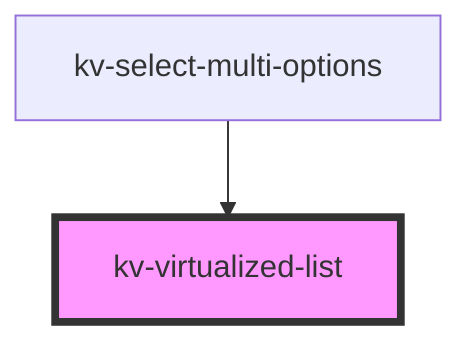

# _<kv-virtualized-list>_

<!-- Auto Generated Below -->

## Properties

| Property        | Attribute     | Description                                                                                          | Type                                                                                                                | Default     |
| --------------- | ------------- | ---------------------------------------------------------------------------------------------------- | ------------------------------------------------------------------------------------------------------------------- | ----------- |
| `getItemHeight` | --            | (optional) Defines the dynamic height of the list. It's usefull when the items have diferent heights | `(index: number) => number`                                                                                         | `undefined` |
| `getItemKey`    | --            | (required) Defines the given item key                                                                | `(index: number) => string`                                                                                         | `undefined` |
| `itemCount`     | `item-count`  | (required) Defines the total number of items rendered in the list                                    | `number`                                                                                                            | `undefined` |
| `itemHeight`    | `item-height` | (required) Defines the estimated height of an item                                                   | `number`                                                                                                            | `undefined` |
| `renderItem`    | --            | (required) Defines the item render function                                                          | `(index: number) => ChildType \| Promise<ChildType> \| ChildType[] \| Promise<ChildType[]> \| Promise<ChildType>[]` | `undefined` |

## CSS Custom Properties

| Name                            | Description                           |
| ------------------------------- | ------------------------------------- |
| `--virtualized-list-max-height` | Virtualized list maximum height.      |
| `--virtualized-list-min-height` | Virtualized list list minimum height. |

## Dependencies

### Used by

 - [kv-select-multi-options](../select-multi-options)

### Graph

----------------------------------------------

