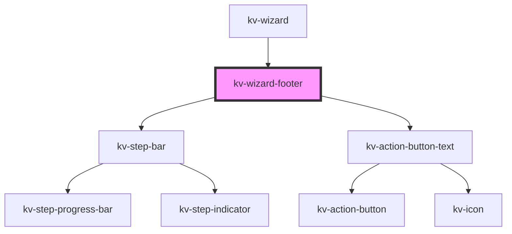

# _<kv-wizard-footer>_


<!-- Auto Generated Below -->


## Usage

### Angular

```html
<!-- Default -->
<kv-wizard-footer
	[steps]="stepsSuccess"
	[currentStep]="currentStep"
	progressPercentage="50"
	(onStepClick)="onStepClick($event)"
	(onPrevClick)="onPrevClick()"
	(onNextClick)="onNextClick()"
/>

<!-- Has errors -->
<kv-wizard-footer
	[steps]="stepsError"
	[currentStep]="currentStep"
	progressPercentage="50"
	(onStepClick)="onStepClick($event)"
	(onPrevClick)="onPrevClick()"
	(onNextClick)="onNextClick()"
	hasError
/>
```


### React

```tsx
import React from 'react';

import { KvWizardFooter } from '@kelvininc/react-ui-components';
import { BUTTONS_CONFIG } from './config';

export const KvWizardFooterExample: React.FC = () => {
	const stepsSuccess = [
		{
			stepKey: 'step0',
			enabled: true,
			active: true
		},
		{
			stepKey: 'step1',
			enabled: true,
			active: true
		},
		{
			stepKey: 'step2',
			enabled: false
		}
	];

	const stepsError = [
		{
			stepKey: 'step0',
			enabled: true,
			active: true,
			hasError: true
		},
		{
			stepKey: 'step1',
			enabled: true,
			active: true,
			hasError: true
		},
		{
			stepKey: 'step2',
			enabled: false
		}
	];

	const onStepClick = ({ detail }: CustomEvent<number>) => {};
	const onPrevClick = (ev: CustomEvent<void>) => {};
	const onNextClick = (ev: CustomEvent<void>) => {};

	return (
		<>
			{/*-- Default --*/}
			<KvWizardFooter
				steps={stepsSuccess}
				currentStep={0}
				progressPercentage={50}
				onStepClick={onStepClick}
				onPrevClick={onPrevClick}
				onNextClick={onNextClick} />
			{/*-- Has errors --*/}
			<KvWizardFooter
				steps={stepsError}
				currentStep={0}
				progressPercentage={50}
				onStepClick={onStepClick}
				onPrevClick={onPrevClick}
				onNextClick={onNextClick}
				hasError />
		</>
	);
};
```


## Properties

| Property                          | Attribute             | Description                                                                                  | Type             | Default     |
| --------------------------------- | --------------------- | -------------------------------------------------------------------------------------------- | ---------------- | ----------- |
| `currentStep` _(required)_        | `current-step`        | (required) Defines the current step index                                                    | `number`         | `undefined` |
| `hasError`                        | `has-error`           | (optional) Defines if the progress bar should be in an error state                           | `boolean`        | `undefined` |
| `label`                           | `label`               | (optional) Defines the label to display next to the step counter (defaults to: "Progress: ") | `string`         | `undefined` |
| `nextBtnLabel`                    | `next-btn-label`      | (required) A label to show on the `next` button                                              | `string`         | `'Next'`    |
| `nextEnabled`                     | `next-enabled`        | (required) Defines if the `next` button should be enabled and interactable                   | `boolean`        | `true`      |
| `prevBtnLabel`                    | `prev-btn-label`      | (optional) A label to show on the `previous` button                                          | `string`         | `undefined` |
| `prevEnabled`                     | `prev-enabled`        | (required) Defines if the `previous` button should be enabled and interactable               | `boolean`        | `true`      |
| `progressPercentage` _(required)_ | `progress-percentage` | (required) Defines the percentage of steps completed                                         | `number`         | `undefined` |
| `showStepBar`                     | `show-step-bar`       | (optional) Defines if the step bar should render                                             | `boolean`        | `true`      |
| `steps` _(required)_              | --                    | (required) Defines the steps array to render                                                 | `IStepBarStep[]` | `undefined` |


## Events

| Event       | Description                                                      | Type                  |
| ----------- | ---------------------------------------------------------------- | --------------------- |
| `nextClick` | Fires when the `next` button is clicked                          | `CustomEvent<void>`   |
| `prevClick` | Fires when the `previous` button is clicked                      | `CustomEvent<void>`   |
| `stepClick` | Fires when a step on the step bar is clicked and emits the index | `CustomEvent<number>` |


## CSS Custom Properties

| Name              | Description                                             |
| ----------------- | ------------------------------------------------------- |
| `--stepper-width` | defines in px how much space the stepper should take up |


## Dependencies

### Used by

 - [kv-wizard](../wizard)

### Depends on

- [kv-step-bar](../step-bar)
- [kv-action-button-text](../action-button-text)

### Graph


----------------------------------------------


