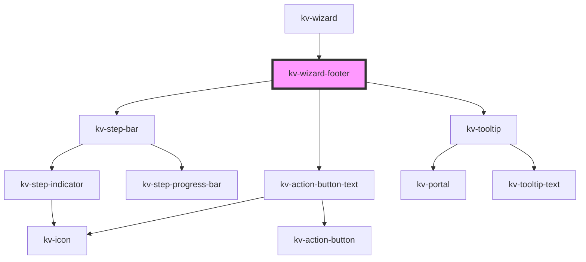

# _<kv-wizard-footer>_


<!-- Auto Generated Below -->


## Usage

### React

```tsx
import React from 'react';

import { KvWizardFooter } from '@kelvininc/react-ui-components';
import { BUTTONS_CONFIG } from './config';

export const KvWizardFooterExample: React.FC = () => {
	const stepsSuccess = [
		{
			stepKey: 'step0',
			enabled: true,
			active: true
		},
		{
			stepKey: 'step1',
			enabled: true,
			active: true
		},
		{
			stepKey: 'step2',
			enabled: false
		}
	];

	const stepsError = [
		{
			stepKey: 'step0',
			enabled: true,
			active: true,
			hasError: true
		},
		{
			stepKey: 'step1',
			enabled: true,
			active: true,
			hasError: true
		},
		{
			stepKey: 'step2',
			enabled: false
		}
	];

	const onStepClick = ({ detail }: CustomEvent<number>) => {};
	const onPrevClick = (ev: CustomEvent<void>) => {};
	const onNextClick = (ev: CustomEvent<void>) => {};

	return (
		<>
			{/*-- Default --*/}
			<KvWizardFooter
				steps={stepsSuccess}
				currentStep={0}
				progressPercentage={50}
				onStepClick={onStepClick}
				onPrevClick={onPrevClick}
				onNextClick={onNextClick} />
			{/*-- Has errors --*/}
			<KvWizardFooter
				steps={stepsError}
				currentStep={0}
				progressPercentage={50}
				onStepClick={onStepClick}
				onPrevClick={onPrevClick}
				onNextClick={onNextClick}
				hasError />
		</>
	);
};
```


## Properties

| Property                          | Attribute             | Description                                                                                  | Type             | Default     |
| --------------------------------- | --------------------- | -------------------------------------------------------------------------------------------- | ---------------- | ----------- |
| `cancelEnabled`                   | `cancel-enabled`      | (optional) Defines if the `cancel` button should be enabled and interactable                 | `boolean`        | `true`      |
| `completeBtnLabel`                | `complete-btn-label`  | (optional) The `complete` button label                                                       | `string`         | `'Submit'`  |
| `completeEnabled`                 | `complete-enabled`    | (optional) Defines if the `complete` button should be enabled and interactable               | `boolean`        | `undefined` |
| `completeTooltip`                 | `complete-tooltip`    | (optional) The `complete` button tooltip                                                     | `string`         | `undefined` |
| `currentStep` _(required)_        | `current-step`        | (required) Defines the current step index                                                    | `number`         | `undefined` |
| `hasError`                        | `has-error`           | (optional) Defines if the progress bar should be in an error state                           | `boolean`        | `undefined` |
| `label`                           | `label`               | (optional) Defines the label to display next to the step counter (defaults to: "Progress: ") | `string`         | `undefined` |
| `nextEnabled`                     | `next-enabled`        | (optional) Defines if the `next` button should be enabled and interactable                   | `boolean`        | `true`      |
| `nextTooltip`                     | `next-tooltip`        | (optional) The `next` button tooltip                                                         | `string`         | `undefined` |
| `prevEnabled`                     | `prev-enabled`        | (optional) Defines if the `previous` button should be enabled and interactable               | `boolean`        | `true`      |
| `progressPercentage` _(required)_ | `progress-percentage` | (required) Defines the percentage of steps completed                                         | `number`         | `undefined` |
| `showCancelBtn`                   | `show-cancel-btn`     | (optional) A boolean that determines whether the `cancel` button should be shown             | `boolean`        | `undefined` |
| `showCompleteBtn`                 | `show-complete-btn`   | (optional) A boolean that determines whether the `complete` button should be shown           | `boolean`        | `undefined` |
| `showNextBtn`                     | `show-next-btn`       | (optional) A boolean that determines whether the `next` button should be shown               | `boolean`        | `undefined` |
| `showPrevBtn`                     | `show-prev-btn`       | (optional) A boolean that determines whether the `previous` button should be shown           | `boolean`        | `undefined` |
| `showStepBar`                     | `show-step-bar`       | (optional) Defines if the step bar should render                                             | `boolean`        | `true`      |
| `steps` _(required)_              | `steps`               | (required) Defines the steps array to render                                                 | `IStepBarStep[]` | `undefined` |


## Events

| Event           | Description                                                      | Type                      |
| --------------- | ---------------------------------------------------------------- | ------------------------- |
| `cancelClick`   | Fires when the `cancel` button is clicked                        | `CustomEvent<MouseEvent>` |
| `completeClick` | Fires when the `complete` button is clicked                      | `CustomEvent<MouseEvent>` |
| `nextClick`     | Fires when the `next` button is clicked                          | `CustomEvent<MouseEvent>` |
| `prevClick`     | Fires when the `previous` button is clicked                      | `CustomEvent<MouseEvent>` |
| `stepClick`     | Fires when a step on the step bar is clicked and emits the index | `CustomEvent<number>`     |


## Shadow Parts

| Part                         | Description                                            |
| ---------------------------- | ------------------------------------------------------ |
| `"footer-actions-container"` | the container of footer stepper and additional actions |


## CSS Custom Properties

| Name              | Description                                             |
| ----------------- | ------------------------------------------------------- |
| `--stepper-width` | defines in px how much space the stepper should take up |


## Dependencies

### Used by

 - [kv-wizard](../wizard)

### Depends on

- [kv-step-bar](../step-bar)
- [kv-action-button-text](../action-button-text)
- [kv-tooltip](../tooltip)

### Graph


----------------------------------------------


