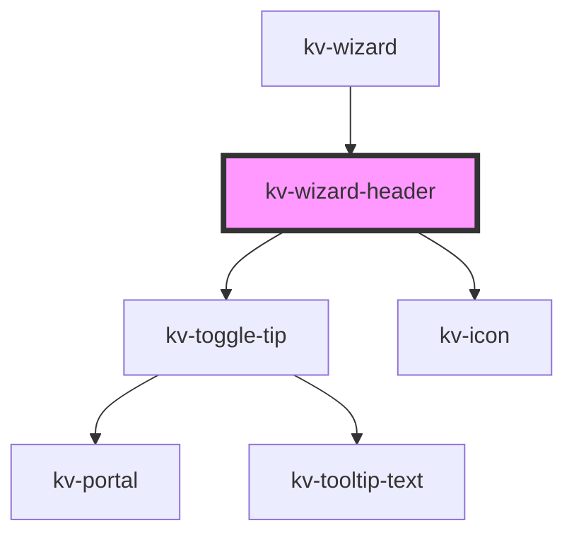

# _<kv-wizard-header>_


<!-- Auto Generated Below -->


## Usage

### Angular

```html
<!-- Required properties only -->
<kv-wizard-header label="Label 1" description="Example label" />

<!-- Custom separator -->
<kv-wizard-header label="Label 1" description="Example label" separator="/" />
```


### React

```jsx
import React from 'react';

import { KvWizardHeader } from '@kelvininc/react-ui-components';

export const WizardHeaderExamples = () => (
	<>
		{/*-- Required properties only --*/}
		<KvWizardHeader label="Label 1" description="Example label" />

		{/*-- Custom separator --*/}
		<KvWizardHeader label="Label 1" description="Example label" separator="/" />
	</>
);
```


## Properties

| Property                   | Attribute     | Description                                                           | Type     | Default     |
| -------------------------- | ------------- | --------------------------------------------------------------------- | -------- | ----------- |
| `description` _(required)_ | `description` | (required) A description of the state (e.g the description of a step) | `string` | `undefined` |
| `label` _(required)_       | `label`       | (required) A title to describe a state (e.g step)                     | `string` | `undefined` |
| `tip`                      | `tip`         | (optional) An extra information for the step                          | `string` | `undefined` |


## CSS Custom Properties

| Name                | Description                        |
| ------------------- | ---------------------------------- |
| `--separator-color` | The color to use for the separator |
| `--text-color`      | The color to use for all text      |


## Dependencies

### Used by

 - [kv-wizard](../wizard)

### Depends on

- [kv-toggle-tip](../toggle-tip)
- [kv-icon](../icon)

### Graph


----------------------------------------------


