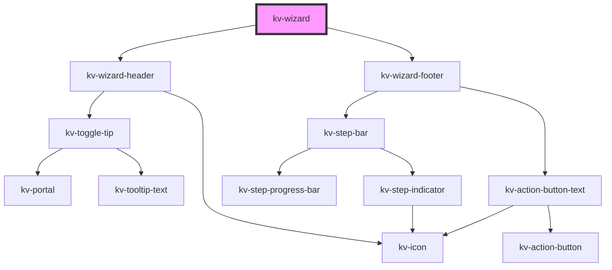

# _<kv-wizard>_


<!-- Auto Generated Below -->


## Usage

### React

```tsx
import React from 'react';

import { IWizardStep, KvWizard } from '@kelvininc/react-ui-components';

export const KvWizardExample: React.FC = () => {
	const steps: IWizardStep[]  = [
		{
			title: 'Info' ,
			allowGoBack: true
		},
		{
			enabled: 'Configuration',
			allowGoBack: true
		}
	];

	const onGoToStep = ({ detail }: CustomEvent<number>) => {};
	const onSubmitClick = (ev: CustomEvent<void>) => {};
	const onCancelClick = (ev: CustomEvent<void>) => {};

	return (
		<KvWizardFooter
			steps={steps}
			currentStep={0}
			hasError={false}
			showStepBar={true}
			showHeader={true}
			submitBtnLabel="Deploy"
			onGoToStep={onGoToStep}
			onSubmitClick={onSubmitClick}
			onCancelClick={onCancelClick} />
	);
};
```


## Properties

| Property                   | Attribute            | Description                                                                         | Type                                     | Default     |
| -------------------------- | -------------------- | ----------------------------------------------------------------------------------- | ---------------------------------------- | ----------- |
| `completeBtnLabel`         | `complete-btn-label` | (optional) A label to show on the last step button. Default: 'Submit'               | `string`                                 | `undefined` |
| `currentStep` _(required)_ | `current-step`       | (required) Defines the current step index                                           | `number`                                 | `undefined` |
| `currentStepState`         | `current-step-state` | (optional) Defines the current step state. Only the success state allows to proceed | `EStepState.Error \| EStepState.Success` | `undefined` |
| `showHeader`               | `show-header`        | (optional) Defines if the header should render. Default: true                       | `boolean`                                | `true`      |
| `showStepBar`              | `show-step-bar`      | (optional) Defines if the step bar should render. Default: true                     | `boolean`                                | `true`      |
| `steps` _(required)_       | --                   | (required) Defines the wizard steps                                                 | `IWizardStep[]`                          | `undefined` |


## Events

| Event           | Description                                         | Type                  |
| --------------- | --------------------------------------------------- | --------------------- |
| `cancelClick`   | Fires when a cancel button is clicked               | `CustomEvent<void>`   |
| `completeClick` | Fires when a complete button is clicked             | `CustomEvent<void>`   |
| `goToStep`      | Fires when it's necessary to go to a different step | `CustomEvent<number>` |


## CSS Custom Properties

| Name                     | Description                                       |
| ------------------------ | ------------------------------------------------- |
| `--wizard-footer-height` | defines how much space the footer should take up  |
| `--wizard-header-height` | defines how much space the header should take up  |
| `--wizard-stepper-width` | defines how much space the stepper should take up |


## Dependencies

### Depends on

- [kv-wizard-header](../wizard-header)
- [kv-wizard-footer](../wizard-footer)

### Graph


----------------------------------------------


